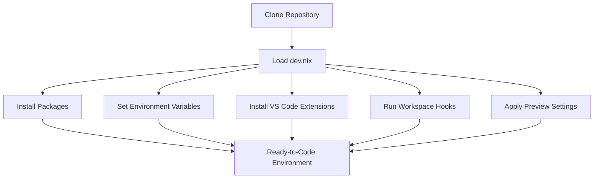

# Development Environment Configuration with `dev.nix` 🎯

This documentation explains the structure, purpose, and features of the provided `dev.nix` file. The file defines a reproducible development environment using Nix, tailored for modern software engineering workflows.

## Overview

The `dev.nix` file describes:
- The Nix channel to use
- A set of core packages for development
- Visual Studio Code (VS Code) extensions for enhanced productivity
- Customizable workspace hooks for automation
- A setting to disable previews in the development workspace

This configuration makes it simple to onboard new developers, ensure consistency across machines, and provide a ready-to-code environment.

---

## Features of the `dev.nix` File

`dev.nix` provides the following key features:

- **Channel Pinning:** Uses a specific Nixpkgs channel to guarantee reproducibility.
- **Curated Dev Packages:** Installs essential tools for source control, virtualization, and cloud image management.
- **VS Code Extensions:** Preinstalls Flutter and Dart support for rapid development.
- **Custom Hooks:** Supports workspace automation with `onCreate` and `onStart` hooks.
- **Previews Control:** Option to disable browser-based previews for security and focus.

---

## Key Configuration Structure

Below, we break down the main sections of the `dev.nix` file and explain their purpose.

### Nixpkgs Channel Selection

Defines which Nix package set version to use.

```nix
channel = "stable-24.05";
```

- **Purpose:** Ensures a consistent set of packages across all environments.
- **Best Practice:** Use a stable channel for predictable builds; `unstable` is available for bleeding-edge needs.

---

### Essential Packages

Installs developer tools and utilities required for the project.

```nix
packages = [
  pkgs.unzip
  pkgs.openssh
  pkgs.git
  pkgs.qemu_kvm
  pkgs.sudo
  pkgs.cdrkit
  pkgs.cloud-utils
  pkgs.qemu
];
```

| Package         | Purpose                                      |
|-----------------|----------------------------------------------|
| unzip           | Extract ZIP archives                         |
| openssh         | Secure Shell client/server                   |
| git             | Version control                              |
| qemu_kvm        | Virtualization (KVM support)                 |
| sudo            | Privilege escalation                         |
| cdrkit          | CD/DVD mastering tools                       |
| cloud-utils     | Cloud image manipulation                     |
| qemu            | Generic virtual machine emulator             |

---

### Environment Variables

```nix
env = {};
```

- **Purpose:** Allows you to inject custom environment variables into the workspace.
- **Default:** Empty; customize as needed.

---

### VS Code Extensions Integration

Configures extensions to be automatically available in your workspace.

```nix
extensions = [
  "Dart-Code.flutter"
  "Dart-Code.dart-code"
];
```

| Extension          | Description                |
|--------------------|---------------------------|
| Dart-Code.flutter  | Flutter development tools |
| Dart-Code.dart-code| Dart language support     |

- **How to Find Extensions:** Browse [Open VSX Registry](https://open-vsx.org/) and use the `publisher.id` format.

---

### Workspace Hooks

Automate workspace behavior with customizable hooks.

```nix
workspace = {
  onCreate = {};
  onStart = {};
};
```

- **onCreate:** Runs when the workspace is created for the first time.
- **onStart:** Runs on every workspace start or restart.

- **Customization Tip:** Add scripts or commands as needed (e.g., initial setup, dependency installation).

---

### Preview Control

Prevents the workspace from auto-starting browser previews.

```nix
previews = {
  enable = false;
};
```

- **Purpose:** Enhances security and reduces distraction.
- **Default:** Disabled; enable as required.

---

## Full `dev.nix` Example

Here is the complete file for reference:

```nix
{ pkgs, ... }: {
  # Which nixpkgs channel to use.
  channel = "stable-24.05"; # or "unstable"

  # Use https://search.nixos.org/packages to find packages
  packages = [
    pkgs.unzip
    pkgs.openssh
    pkgs.git
    pkgs.qemu_kvm
    pkgs.sudo
    pkgs.cdrkit
    pkgs.cloud-utils
    pkgs.qemu
  ];

  # Sets environment variables in the workspace
  env = {};

  idx = {
    # Search for the extensions you want on https://open-vsx.org/ and use "publisher.id"
    extensions = [
      "Dart-Code.flutter"
      "Dart-Code.dart-code"
    ];

    workspace = {
      # Runs when a workspace is first created with this `dev.nix` file
      onCreate = {};
      # To run something each time the workspace is (re)started, use the `onStart` hook
      onStart = {};
    };

    # Disable previews completely
    previews = {
      enable = false;
    };
  };
}
```

---

## Typical Use Case Flow

A new developer or CI runner executes `nix develop` or opens the project in a Nix-aware IDE. The environment is automatically provisioned as described.



---

## Customization Tips

- **Add Packages:** Use the Nix package search to find and add new tools as needed.
- **Set Environment Variables:** Populate the `env` attribute for secrets or tool configuration.
- **Automate Hooks:** Place shell commands in `onCreate` and `onStart` for bootstrapping.
- **Expand Extensions:** Enhance DX by adding more VS Code plugins relevant to your tech stack.

---

```card
{
  "title": "Reproducible Environments",
  "content": "By using dev.nix, every team member gets the same tools, extensions, and environment—guaranteeing consistency and saving onboarding time."
}
```

---

## Conclusion

The `dev.nix` file is central to a reproducible, productive, and automated development workflow. It ensures that everyone in your team, on any system, launches into a consistent and fully equipped development environment. Expand and tailor it as your project evolves!
